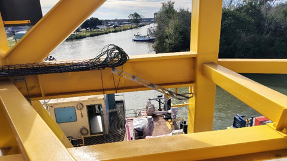
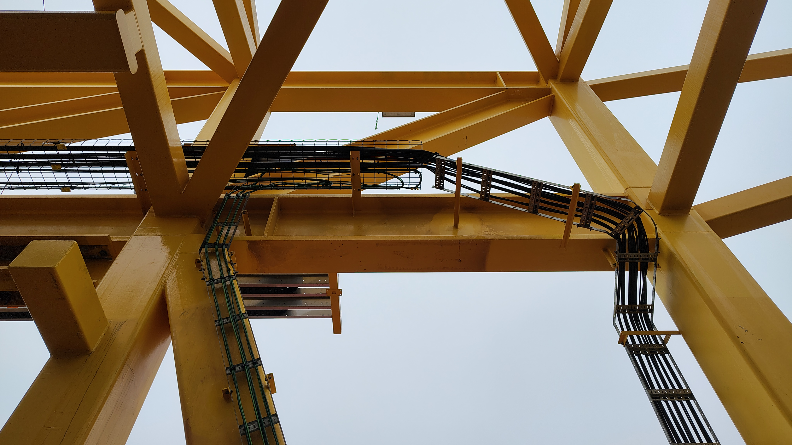

# Armor One – At-Height Cable Routing
## Plan of Action & Field Execution Summary

## Context
Armor One gantry and barge cabling required routing from horizontal cable trays into vertical cable ways at height. The work involved power and communication cabling with separation requirements and limited access geometry around structural beams.

## Objective
Safely and repeatably route cabling from the cable tray into the vertical cable way using man lifts, minimizing at-height handling, balance-dependent work, and uncontrolled cable movement.

---

## Access & Equipment

Primary access method:
- Two shipyard-supplied man lifts

Contingency:
- Beam tie-offs retained if lift reach proved insufficient
- Tie-offs also required to release cable ends currently secured with zip ties

Support:
- Two shipyard laborers (one per lift) for lift operation and cable handling

---

## Staffing

- Lift 1: Jeremy + shipyard laborer  
- Lift 2: Aaron Leeper + shipyard laborer  

Safety approval was obtained for man-lift-based access, replacing the earlier beam-walk and tie-off method as the primary approach.

---

## Routing Strategy

A controlled slack and lift-to-lift handoff method was used to reduce complexity and risk at height.

Cable separation:
- Communication cabling routed to dog box
- Power cabling routed to power e-box

---

## Execution Plan

1. Remove cabling from the cable tray in a controlled manner  
2. Stage intentional slack on the deck to manage cable behavior and reduce tension  
3. Position both man lifts at the routing location  
4. Manage cable ends from the lifts, using handoff between lifts as needed  
5. Route communication cabling down through designated wireway  
6. Thread power cabling between beam and cable way to transition into vertical section  
7. Route downward into vertical cable way rather than forcing lateral movement at height  
8. Repeat sequence on far side of barge  

---

## Key Risk Areas

- Threading cable under beam and through gap between beam and wireway  
- Cable stiffness and memory during at-height handling  
- Potential communication barrier with labor support  

---

## Risk Mitigations

- Deck-staged slack to reduce force and cable memory  
- Minimized time spent balancing or repositioning at height  
- Beam tie-off option retained as contingency  
- Safety meeting conducted prior to at-height work  

---

## Success Criteria

- Cable routed into vertical cable ways without uncontrolled movement  
- Minimal manual handling required at height  
- Repeatable process established for both sides of barge  
- No injuries  
- No damage to cabling  

---

# Field Execution Summary

## Overview
This trip focused on planning and executing at-height cable routing on the gantry and barge. Work included development of a safe, repeatable routing plan; execution on both north and south sides; and transition of remaining minor work to local support ahead of weather disruptions.

---

## Monday – Arrival (MLK Holiday)

Arrival delayed due to flight disruptions and extended hotel check-in.  
No site activity.

---

## Tuesday – Planning & Site Assessment

- Completed walkthroughs with Dan Summitt and Jeremy McDowell  
- Confirmed routing constraints  
- Finalized at-height execution plan using man lifts as primary access  
- Established routing separation for communication and power cabling  
- Finalized staffing and safety approach  

(Detailed planning documented in routing plan above)

---

## Wednesday – North Side Gantry/Barge Routing

Executed routing strategy on north side:

Morning:
- At-height routing using man lifts
- Removal from tray
- Deck-staged slack management
- Lift-to-lift cable handoffs
- Vertical cable way transitions

Afternoon:
- Lower elevation routing
- Cleanup and organization

Outcome:
- Plan performed as intended
- Significant reduction in balance-dependent work and at-height complexity

Support:
- Jeremy assisted with routing

---

## Thursday – South Side Gantry/Barge Routing

Repeated routing process on south side:

- Same sequence as north side
- Morning at-height work
- Afternoon lower elevation routing

Outcome:
- Process confirmed repeatable and controllable across both sides

Support:
- Dan assisted with routing due to Jeremy medical appointment

---

## Friday – Closeout & Departure

- Completed full site walkthrough with Jeremy  
- Confirmed final ~10 yards of routing remaining per side  
- Remaining work suitable for completion by local support  

Weather impact:
- Severe weather affecting national travel
- Departed site early to relocate closer to airport
- Original flight canceled
- Repositioning allowed earlier successful departure

---

## Status at Departure

- Major gantry and barge cable routing complete on both sides  
- Remaining work minimal and clearly defined  
- Routing approach validated as safe, repeatable, and effective  

---

## Cable Condition Note

Observed minor damage on two cables:
- One communication cable
- One power cable

Condition:
- Outer insulation jacket damage only
- Shielding and internal conductors intact
- No exposed conductors

Assessment:
- Damage appears pre-existing (dirt accumulation at damage sites)

Resolution:
- Likely removed during final terminations
- If not, repairable using standard cable repair methods

---

## Open Items

- Stand required for wire/cable label printer in shipyard office  
- Follow-up procurement required  

---

## Lessons Learned

Use of experienced shipyard man-lift operators significantly improved safety and execution efficiency.

Observations:
- Operators positioned lifts more precisely and consistently than occasional users
- Reduced repositioning time at height
- Allowed technical staff to focus on routing and installation instead of equipment operation

Conclusion:
Dedicated lift operators should be considered standard practice for future at-height routing operations.

---

## Result

The man-lift-based routing method provided:
- Controlled cable handling
- Reduced risk at height
- Consistent, repeatable execution
- Successful routing on both sides of the barge

This method is now validated for continued use on Armor One cable routing operations.

## Field Photos

### North Side Routing (pre)

### North Side Routing (installed)

